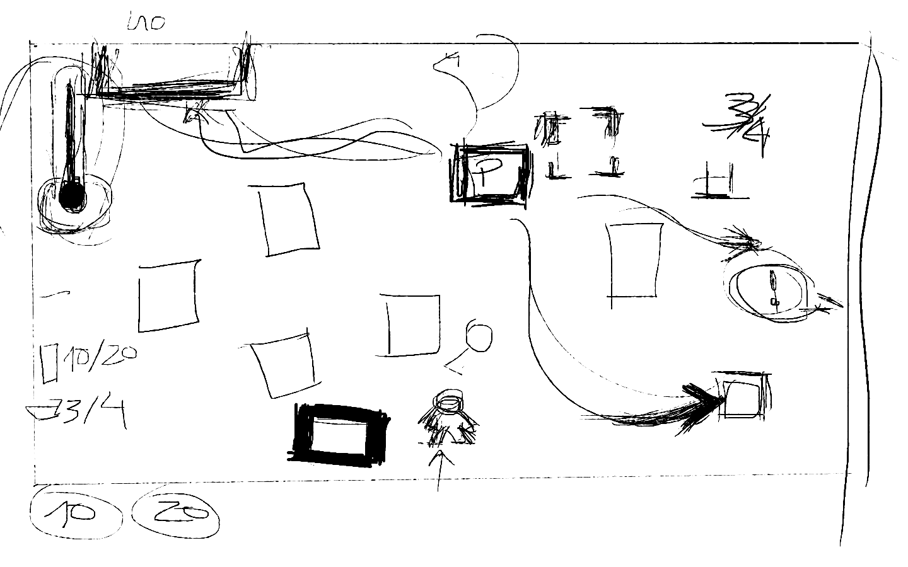

# Don't Let The Party Die

**Don't Let The Party Die** is a party-resource-management game that will take your running-around skills to the next level. As Jaiminho, the manager demon, try to make the party last as long as you can while hell breaks loose.

Made in 72 hours for Ludum Dare 46. Check it out: https://ldjam.com/events/ludum-dare/46/dont-let-the-party-die/

## **Controls**:
- WASD - movement
- Mouse left-click - interact with the environment

## **Team**:
- Diogohex (Dev) - https://twitter.com/diogohex
- Inacho (Dev) - https://twitter.com/inacho_
- ZezaumZZ (Artist) - https://twitter.com/ZezaumZZZ
- Kbooz (Artist) - https://twitter.com/kbooz

Game design done by all members! 

Initial Mockup:

